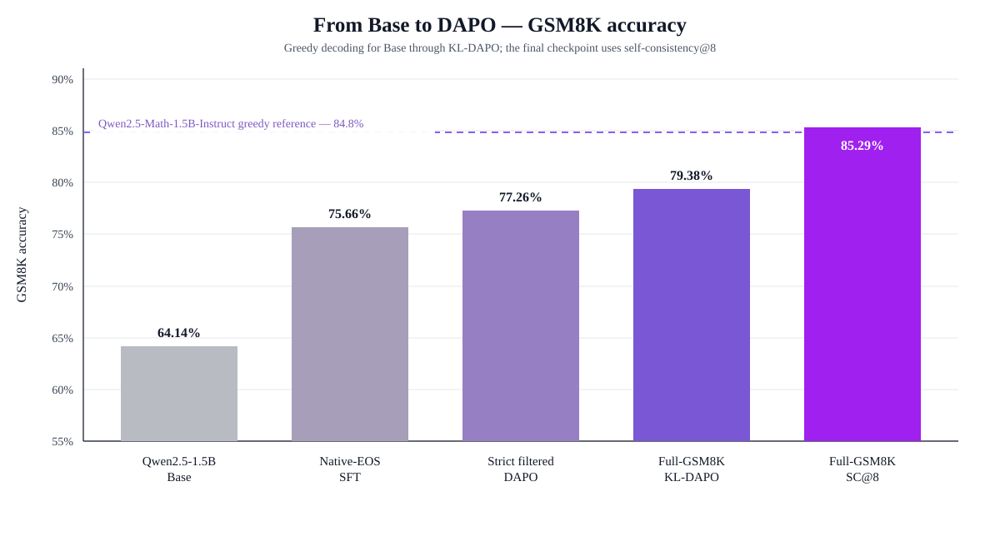
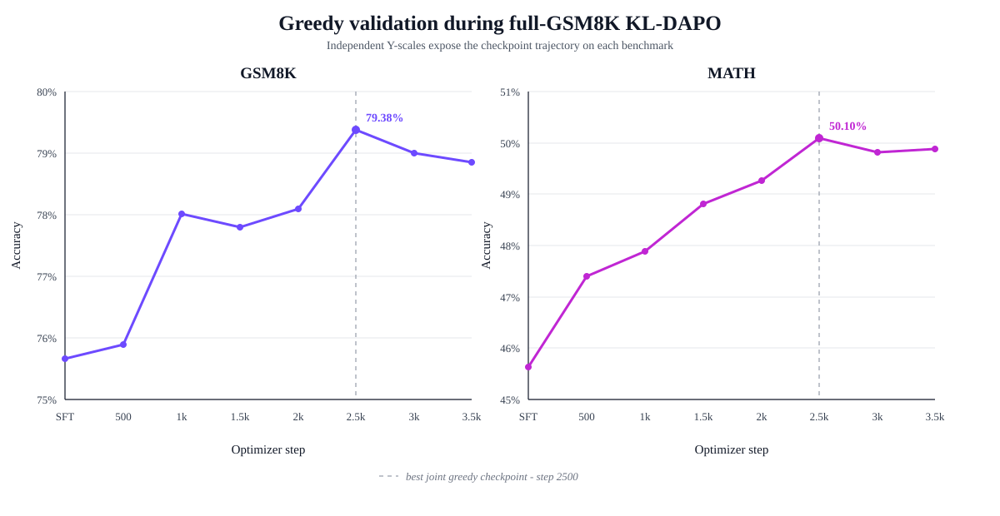

<div align="center">

# Math Post-Training on a Qwen-2.5-1.5B-Base Model

**A reproducible BASE -> SFT -> DAPO Qwen post-training cycle with GSM8K as the primary target and MATH as the harder generalization benchmark. Compared with math-specialized [`Qwen2.5-Math`](https://arxiv.org/abs/2409.12122) checkpoint as a stronger-model reference for capability estimation.**

[](https://www.python.org/)
[](https://huggingface.co/docs/trl/index)
[](https://vllm.ai/)
[](https://github.com/NotHotTryHard/math-post-training/pkgs/container/math-post-training)
[](LICENSE)

Starting from **`Qwen/Qwen2.5-1.5B-base`**, the final pipeline reaches
**79.38% GSM8K / 50.10% MATH with greedy decoding** and
**85.29% GSM8K / 57.78% MATH with self-consistency@8** versus
**84.80% GSM8K / 75.81% MATH with greedy decoding of `Qwen/Qwen2.5-Math-1.5B-Instruct`**
.

[Results](#results) · [What mattered](#what-actually-mattered) · [Ablations](#ablation-led-development) · [Reproduce](#reproduce-it) · [Detailed docs](docs/reproducibility.md)

</div>

---

## TL;DR

| Stage | GSM8K | MATH | What changed |
| --- | ---: | ---: | --- |
| Local Base baseline | 64.14 | 32.08 | Qwen Base few-shot CoT protocol |
| Native-EOS SFT | 75.66 | 45.64 | 296K OpenMathInstruct-2 examples, plain policy format |
| Full-GSM8K KL-DAPO, greedy | **79.38** | **50.10** | strict verifiable reward, full GSM8K, `beta=1e-3` |
| Full-GSM8K KL-DAPO, SC@8 | **85.29** | **57.78** | checkpoint 3000, majority vote over 8 samples |

The result was not produced by copying a single recipe. The useful configuration emerged from
ablations over prompt/EOS format, SFT data scale, LoRA scaling, effective batch size, reward
strictness, rollout group size, filtered versus full GSM8K, KL regularization, DeepMath selection,
and GPU scheduling.

The most important early correction was to drop the attempts to teach a Base model answeing in ChatML format (we need much more data + full finetune, not the LoRA). Instead I replaced the inherited ChatML-style policy interface with one plain prompt and the
native Base tokenizer EOS, `<|endoftext|>`, which fixed the training/inference contract before more compute
was spent on SFT or RL.

## Results



All project results below were measured locally with the repository evaluator. Greedy runs use `max_new_tokens=2048`. SC@8 uses 8 samples at `temperature=0.8`, `top_p=0.95`, then selects the most frequent normalized final answer.

| Model / checkpoint | Decoding | GSM8K | GSM1K | MATH | MMLU-STEM |
| --- | --- | ---: | ---: | ---: | ---: |
| Qwen2.5-1.5B Base, local baseline | greedy | 64.14 | 58.17 | 32.08 | 42.31 |
| ChatML SFT, 98K | greedy | 69.60 | 64.23 | 33.74 | **52.17** |
| Native-EOS SFT, 296K | greedy | 75.66 | 69.88 | 45.64 | 41.93 |
| Strict filtered-GSM8K DAPO | greedy | 77.26 | 72.20 | 49.84 | **44.59** |
| Full-GSM8K KL-DAPO, step 2500 | greedy | **79.38** | 71.70 | **50.10** | 43.42 |
| Strict filtered-GSM8K DAPO | SC@8 | 83.02 | **79.50** | **58.40** | 49.35 |
| Full-GSM8K KL-DAPO, step 3000 | SC@8 | **85.29** | 78.34 | 57.78 | **49.38** |

**MATH was the better canary.** Earlier permissive DAPO barely moved GSM8K while MATH still grew. A GSM8K plateau therefore did not imply that RL had stopped improving mathematical reasoning.

### Full-GSM8K KL-DAPO checkpoint sweep



GSM8K is noisy after step 1000; MATH rises much more smoothly until step 2500. This is exactly why
the integrated sweep evaluates more than the training-domain benchmark.

> [!NOTE]
> These checkpoint evaluations are retrospective test analysis. Best model selection used
> a held-out GSM8K development split and an independent math validation set to avoid test leakage.

## What actually mattered

### 1. Match the policy format to the Base model

The project starts from [`Qwen/Qwen2.5-1.5B`](https://huggingface.co/Qwen/Qwen2.5-1.5B), not an
Instruct checkpoint. Teaching it a complete ChatML interaction contract was not just a formatting
change: the model had to learn new control tokens, turn boundaries, and stopping behavior. The
98K-example SFT run did not provide enough data, and LoRA did not provide the degrees of freedom of
a full fine-tune, to learn that contract reliably.

The final pipeline instead uses one plain prompt from SFT through RL and inference, and terminates
every training completion with the Base tokenizer's native `<|endoftext|>`. This removed the
avoidable interface-learning problem and made stopping behavior testable. The `69.60 -> 75.66`
GSM8K jump is not a pure format ablation because the native-EOS run also used more data, but the
format and stopping failures disappeared immediately.

### 2. MATH exposed failures that GSM8K hid

GSM8K is short and forgiving; MATH is more sensitive to broken stopping, extraction, and
truncation. During native-EOS SFT, MATH rose from `42.66` to `45.64`, parse rate improved from
`83.76%` to `88.62%`, and truncations fell from `796` to `547`. It remained the useful canary when
GSM8K was noisy or temporarily flat.

### 3. Strict reward beat a permissive proxy

The first pilots used `accuracy + 0.1 × boxed_format` with a last-number fallback. That proxy
could improve while answer format and stopping degraded. The final reward has one unambiguous
contract:

| Completion | Reward |
| --- | ---: |
| correct final `\boxed{...}` | `+1.0` |
| wrong final `\boxed{...}` | `0.0` |
| missing or incomplete box | `-0.5` |

No separate format bonus or fallback is used. Sixteen rollouts provide the within-problem contrast;
DAPO applies token-level loss normalization and asymmetric clipping `[0.8, 1.28]`.

### 4. KL regularization was important 

The decisive final change was `beta=1e-3`. It deliberately slowed the immediate policy update, but
also constrained drift from the SFT policy, allowing useful training to continue for longer. The
best full-GSM8K `beta=0` checkpoint reached `77.94` GSM8K / `49.22` MATH; the KL run continued to
`79.38` / `50.10` at step 2500 and produced the best primary `mean(GSM8K, MATH)` score.

The cool detail is that with `TRL+PEFT`, reference log-probabilities were obtained by temporarily
disabling the LoRA adapter, so this did not require a second resident copy of the 1.5B model.

## Ablation-led development

### SFT: LoRA scaling and effective batch

This controlled 98K-example ablation predates the native-EOS correction, so its absolute scores are
not final-model scores. It is still the clean comparison used to choose the LoRA geometry.

| SFT setting | GSM8K | MATH | Observation |
| --- | ---: | ---: | --- |
| `r32 / a64 / batch 64` | **69.60** | **33.74** | selected |
| `r32 / a128 / batch 64` | 68.69 | 32.88 | larger alpha hurt all four benchmarks |
| `r32 / a64 / batch 32` | 51.78 | 19.50 | unstable long completions and truncation |

The winner remained ordinary LoRA `r32/a64`, not rsLoRA and not the larger `a128` used by an
adjacent public GSM8K recipe.

### RL: reward, group batch, data, and KL

| RL variant | GSM8K | MATH | Main lesson |
| --- | ---: | ---: | --- |
| native-EOS SFT | 75.66 | 45.64 | starting policy |
| permissive DAPO, 32 completions/update | 74.53 | 46.54 | extra noisy updates did not help |
| permissive DAPO, 64 completions/update | 75.82 | 46.82 | lower gradient noise was better |
| strict DAPO, rollout-filtered GSM8K | 77.26 | 49.84 | strict verifiable reward mattered |
| strict DAPO, full GSM8K, `beta=0`, step 2500 | 77.94 | **50.92** | full data retained coverage; best beta-0 primary checkpoint |
| strict DAPO, full GSM8K, `beta=1e-3`, step 2500 | **79.38** | 50.10 | best greedy GSM8K+MATH mean |

Keeping easy `16/16` groups in the dataset does not itself prevent forgetting: a zero-variance
group has zero group-relative advantage. Full GSM8K was nevertheless worth testing because policy
drift can turn an easy task into a mixed group later, and because filtering is a model-relative,
noisy decision. Retention came from monitoring, full-data exposure, conservative LoRA updates, and
KL—not from pretending zero-gradient examples act as replay loss.

### RL data: rollout filtering helped; DeepMath mixing did not

Before RL, the SFT policy generated multiple answers for each training problem. This made it
possible to separate tasks it solved consistently from tasks that still produced both successes
and failures. Training first on the rollout-filtered GSM8K subset concentrated updates on problems
with useful reward variation and gave a clear improvement over the SFT checkpoint. The later
full-GSM8K experiment showed the trade-off: filtering improves signal efficiency, while retaining
the full dataset preserves broader coverage as the policy changes.

DeepMath was the natural next candidate: it is newer, larger, and substantially more varied than
GSM8K, so I expected it to improve general mathematical reasoning. Before training, a stratified
rollout audit across its difficulty levels confirmed that the problems were not simply out of
reach—both the native-EOS SFT policy and Qwen2.5-Math-1.5B-Instruct could solve meaningful portions
of the sample.

I then selected 1,743 DeepMath problems on which the SFT policy produced mixed outcomes and trained
on a `50/50` mixture with full GSM8K. The checkpoint sweep showed no convincing advantage over the
GSM8K-only runs, so the experiment was stopped after step 1400. The useful negative result was
simple: adding a newer and harder dataset did not automatically improve transfer; in this setup,
cleaner reward, full GSM8K coverage, and KL regularization mattered more than broader data.

The sampling audit and selection details remain in
[`docs/deepmath-level-audit-2026-08-28.md`](docs/deepmath-level-audit-2026-08-28.md).

### Systems: 3.54× faster without changing the objective

On one A100 80 GB, the same 64-completion optimizer update was benchmarked under several training
microbatch splits:

| Microbatch / accumulation | vLLM sleep | Mean step | Speedup |
| --- | :---: | ---: | ---: |
| `1 / 64` | on | 23.13 s | 1.00× |
| `4 / 16` | on | 9.49 s | 2.44× |
| `8 / 8` | on | 8.38 s | 2.76× |
| `16 / 4` | on | 8.24 s | 2.81× |
| `8 / 8` | off | **6.53 s** | **3.54×** |

The selected setup kept the training and colocated vLLM copies resident, reached mostly 80–100%
GPU utilization, and reduced a projected ~19-hour strict run to roughly 5.4 hours. The effective
batch, number of rollouts, reward, and number of optimizer updates were unchanged.

## Final recipe

| Component | Choice |
| --- | --- |
| Starting policy | native-EOS SFT from Qwen2.5-1.5B Base |
| SFT data | 296K OpenMathInstruct-2 examples, one epoch |
| SFT LoRA | `r32/a64`, dropout `0.05`, all linear layers |
| RL data | full, unfiltered GSM8K train |
| Reward | strict boxed correctness: `+1 / 0 / -0.5` |
| Algorithm | DAPO loss, clip `0.2/0.28`, group-scaled reward, `beta=1e-3` |
| Sampling | 16 rollouts/prompt, `temperature=0.8`, `top_p=0.95` |
| Optimization | LoRA `r32/a64`, LR `1e-5` cosine, 400-step warmup |
| Batch | 64 completions/update as microbatch `8 × 8` accumulation |
| Runtime | colocated vLLM, sleep disabled, one A100 80 GB |
| Model selection | full four-benchmark greedy eval every 500 steps |

For inference, use **checkpoint 3000**.

## Reproduce it

The repository is designed so that a result is more than a table in a README - everything is set up to be easily resumable from the checkpoints and with no pain in fighting dependencies, just take the [GHCR image](https://github.com/NotHotTryHard/math-post-training/pkgs/container/math-post-training).

```bash
git clone https://github.com/NotHotTryHard/math-post-training.git
cd math-post-training
cp .env.example .env

docker build -t math-post-training .
docker run --gpus all --ipc=host --env-file .env -it math-post-training bash
```

Inside the container:

```bash
# Re-evaluate the final native-EOS SFT checkpoint.
model-eval \
  --config configs/eval/qwen2_5_1_5b_openmath_native_eos_greedy.yaml

# Run the full-GSM8K KL-DAPO train/eval loop.
model-grpo-eval-loop \
  --config configs/grpo/qwen2_5_1_5b_openmath_gsm8k_full_dapo_strict_kl1e3_long.yaml
```

| Resource | Link |
| --- | --- |
| Native-EOS SFT starting checkpoint | [Hugging Face](https://huggingface.co/NotHotTryHard/qwen2.5-1.5b-base-openmath-296k-1epoch-lora-cosine-native-eos-merged) |
| KL-DAPO checkpoint 2500, best greedy GSM8K + MATH | [Hugging Face](https://huggingface.co/NotHotTryHard/qwen2.5-1.5b-openmath-native-eos-gsm8k-full-dapo-strict-kl1e3-long/tree/main/checkpoint-2500) |
| KL-DAPO checkpoint 3000, best SC@8 | [Hugging Face](https://huggingface.co/NotHotTryHard/qwen2.5-1.5b-openmath-native-eos-gsm8k-full-dapo-strict-kl1e3-long/tree/main/checkpoint-3000) |
| Ready-to-run CUDA environment | [GHCR image](https://github.com/NotHotTryHard/math-post-training/pkgs/container/math-post-training) |

The same image runs locally or on RunPod with the repository configs and an `.env` file. Exact
commands for evaluation, training, checkpoint resume, and SC@8 are kept in
[`docs/reproducibility.md`](docs/reproducibility.md) rather than duplicated here. Hugging Face
checkpoints are private and require account access.

## Compute budget

| | Clean final pipeline (active) | Full study + ablations (billed) |
| --- | ---: | ---: |
| Evaluation | ~30 min | ~16.0 h |
| SFT training | ~7.5 h | ~45.0 h |
| Data filtering and dataset audits | — | ~11.0 h |
| RL training | ~6.9 h | ~52.4 h |
| **Total GPU time** | **~14.9 h** | **~124.4 h** |

## Scope and limitations

- This is a single-seed, single-model-scale study.
- Self-consistency costs eight generations per problem and should not be compared with greedy
  decoding.
- I did my best to make this setup (prompt, split, decoding, verifier) as close to published in Qwen Math paper, but even then some compromises were made.

## Research and tooling

The project author set the research direction, designed the experiments and ablations, selected
the models, interpreted the results, and handled RunPod orchestration and part of the diagnostics.
[codex-cli](https://github.com/openai/codex) supported implementation, test writing, and
documentation. It accelerated the engineering loop without making the research decisions or
drawing the conclusions.

## References and related work

- [Qwen2.5-Math Technical Report](https://arxiv.org/abs/2409.12122) — Qwen's SFT, reward-model,
  GRPO, and inference-scaling pipeline.
- [DeepSeekMath](https://arxiv.org/abs/2402.03300) — introduces GRPO for mathematical reasoning.
- [DAPO](https://arxiv.org/abs/2503.14476) — decoupled clipping, dynamic sampling, token-level loss,
  and overlong-reward shaping at scale.
- [OpenMathInstruct-2](https://huggingface.co/datasets/nvidia/OpenMathInstruct-2) — the SFT source.
- [DeepMath-103K](https://huggingface.co/datasets/zwhe99/DeepMath-103K) — the broader mathematics
  dataset evaluated in the mixed RL experiment.
- [Hugging Face TRL SFTTrainer](https://huggingface.co/docs/trl/sft_trainer) — the supervised
  fine-tuning interface and dataset-format reference.
- [TRL GRPOTrainer](https://huggingface.co/docs/trl/index) and [vLLM](https://vllm.ai/) — the training
  and generation stack used here.
- [DrEternity/gsm8k-post-training](https://github.com/DrEternity/gsm8k-post-training) — an adjacent
  open GSM8K SFT/GRPO project and a useful point of comparison for experiment structure.
- [codex-cli](https://github.com/openai/codex) — the terminal engineering assistant used
  during development.
