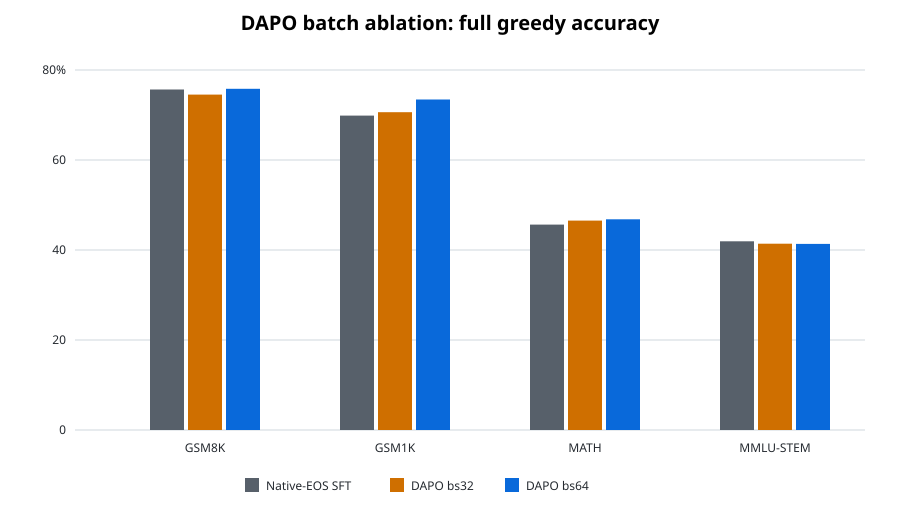

# GSM8K DAPO batch ablation — 2026-08-24

## Протокол

- стартовая модель: native-EOS SFT `Qwen2.5-1.5B`, обученная на 296k OpenMathInstruct-2;
- RL-данные: 3 868 примеров GSM8K train, на которых SFT решила не более 7 из 8 sampled rollouts;
- оба запуска видят каждый пример ровно один раз и используют 8 rollouts на prompt;
- `bs32`: 4 prompt × 8 rollouts, 967 optimizer steps;
- `bs64`: 8 prompt × 8 rollouts, 484 optimizer steps;
- общий старый recipe: LoRA `r32/a64`, LR `1e-5` constant, DAPO, `max_completion_length=1024`;
- старая награда: `accuracy + 0.1 × boxed_format`; accuracy допускала fallback на последнее число;
- внешний eval: полный greedy vLLM, batch 768, `max_new_tokens=2048`.

## Accuracy

| Модель | GSM8K | GSM1K | MATH | MMLU-STEM |
| --- | ---: | ---: | ---: | ---: |
| Native-EOS SFT | 75.6634% | 69.8755% | 45.6400% | **41.9283%** |
| DAPO bs32 | 74.5262% | 70.6224% | 46.5400% | 41.3892% |
| DAPO bs64 | **75.8150%** | **73.4440%** | **46.8200%** | 41.3574% |

Дельта относительно SFT:

| Модель | GSM8K | GSM1K | MATH | MMLU-STEM |
| --- | ---: | ---: | ---: | ---: |
| DAPO bs32 | -1.1372 п.п. | +0.7469 п.п. | +0.9000 п.п. | -0.5391 п.п. |
| DAPO bs64 | +0.1516 п.п. | +3.5685 п.п. | +1.1800 п.п. | -0.5709 п.п. |

## Parse, truncation и длина

Формат: `parse rate / truncated / mean completion tokens`.

| Модель | GSM8K | GSM1K | MATH | MMLU-STEM |
| --- | ---: | ---: | ---: | ---: |
| Native-EOS SFT | 98.79% / 16 / 188.5 | 98.84% / 14 / 216.5 | 88.62% / 547 / 507.0 | 81.10% / 203 / 293.2 |
| DAPO bs32 | 97.27% / 36 / 228.7 | 96.35% / 45 / 277.4 | 84.12% / 780 / 605.7 | 79.99% / 262 / 345.7 |
| DAPO bs64 | 98.56% / 20 / 195.7 | 98.59% / 17 / 225.7 | 87.58% / 599 / 534.5 | 81.03% / 198 / 297.4 |

`bs64` почти полностью устраняет деградацию stopping/format, появившуюся у `bs32`, и лучше его
на GSM8K, GSM1K и MATH. Дополнительные optimizer steps у `bs32` не компенсируют более шумный
update. При равном rollout budget здесь следует предпочесть `bs64`.

Однако даже `bs64` не является удачным итоговым RL recipe. На основной GSM8K метрике прирост к
SFT всего `+0.15` п.п., MMLU-STEM падает, а parse/truncation всё ещё немного хуже SFT. Средняя
train-награда практически одинакова (`0.7241` против `0.7252`), как и доля zero-variance prompt
groups (`0.2435` против `0.2495`): batch size меняет стабильность, но не исправляет постановку
награды.

## Причина и следующий запуск

Старая награда была слишком мягкой: правильный ответ без `\\boxed{}` получал `1.0`, а правильный
boxed-ответ — `1.1`. Fallback на последнее число позволял оптимизировать correctness, почти не
контролируя финальный формат и остановку. Кроме того, этот pilot использовал только один проход,
8 rollouts, LR `1e-5` constant и около 31k rollouts — существенно меньше рецепта сравниваемой
работы.

Следующий запуск начинается заново от SFT и меняет постановку целиком:

- единая строгая награда: correct box `+1`, wrong box `0`, missing box `-0.5`, без fallback;
- 16 rollouts, 3 прохода, около 185.7k rollouts;
- LR `1e-5`, cosine, 10% warmup;
- LoRA `r32/a64/dropout=0.05`; this preserves the stronger setting from our SFT
  ablation instead of copying `a128` from a different checkpoint and data recipe;
- DAPO `epsilon=0.2`, `epsilon_high=0.28`, truncated completions masked;
- `max_completion_length=512`, effective completion batch 64.

Конфиг: `configs/grpo/qwen2_5_1_5b_openmath_gsm8k_nontrivial_dapo_strict.yaml`.

## Артефакты

- bs32 train W&B: `hr7gffuf`; eval: `g1c2jqq5`;
- bs64 train W&B: `ninvm6gq`; eval: `it3fr265`;
- aborted strict `a128/5e-6` diagnostic W&B: `lehf2rku`;
- merged bs32: `NotHotTryHard/qwen2.5-1.5b-openmath-native-eos-gsm8k-nontrivial-dapo-bs32-merged`;
- merged bs64: `NotHotTryHard/qwen2.5-1.5b-openmath-native-eos-gsm8k-nontrivial-dapo-merged`;
- сырые eval summaries и predictions сохранены в `/workspace/outputs/eval/...`.

GSM8K test использован только для ретроспективного сравнения. Выбирать промежуточный checkpoint
по максимуму test accuracy нельзя: для model selection нужен отдельный holdout из train.
